  

  

  

---

## Tentang Saya

  

---

## Tech Stack

<table align="center">
  <tbody>
    <tr>
      <td align="right"><b>Frontend</b></td>
      <td></td>
    </tr>
    <tr>
      <td align="right"><b>Backend</b></td>
      <td></td>
    </tr>
    <tr>
      <td align="right"><b>DevOps &amp; Cloud</b></td>
      <td></td>
    </tr>
    <tr>
      <td align="right"><b>Database &amp; Tools</b></td>
      <td></td>
    </tr>
  </tbody>
</table>

---

## GitHub Stats

  
  

  

  

---

## Aktivitas

  

  

---

## Kontak

  
  

